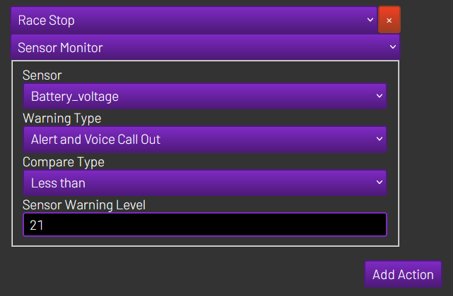

# RH-sensor-monitor
This plugin for [RotorHazard](https://github.com/RotorHazard/RotorHazard) lets you set up a warning on any sensors that is installed within RotorHazard

# How to Install
Run the following command in the SSH terminal to install the sensor monitor 
```
cd ~
wget https://github.com/Aaronsss/RH-sensor-monitor/archive/refs/heads/main.zip
unzip ./main.zip
mv ~/RH-sensor-monitor-main/sensor_monitor/ ~/RotorHazard/src/server/plugins/
rm -R ./RH-sensor-monitor-main/
rm ./main.zip
sudo systemctl restart rotorhazard.service
```

If you wish to install manually, place the sensor_monitor folder within the RotorHazard plugins folder Rotorhazard/src/server/plugins then start / restart the server  

# How to setup

> [!IMPORTANT]
> You must setup an Event Action correctly for this plugin to do anything.  

> [!IMPORTANT]
> The sensor is only checked when the race event happens, so a timer that is sitting there not being used will not check the battery voltage for example  

Go to Settings -> Event Actions tab and add click add action
1. Sensor - the group and name of the sensor you want to monitor
2. Warning Type - Select between messages, warning pop ups or voice call outs (or a combination of those things)
3. Compare Type - Select between less than or greater than. You can also use the calculated battery cell voltage if you wish
4. Sensor Warning Level - The threshold value to use to check with

An example setup to check battery voltage at the end of the race can be seen below:

